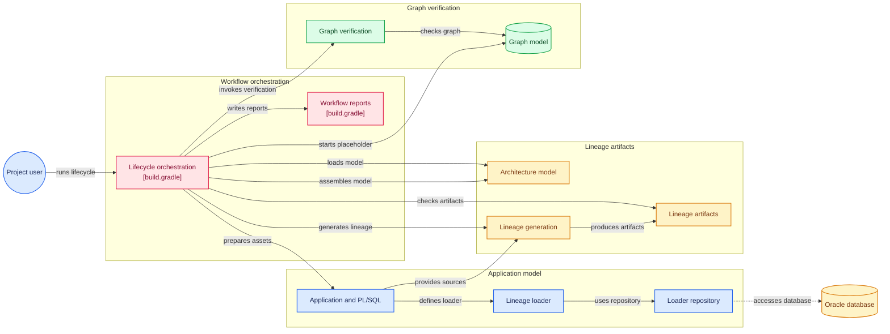

# Architecture Overview example-lineage-plsql

```mermaid
flowchart LR

subgraph group_app["Application model"]
  node_appmodel["Application and PL/SQL"]
  node_loader["Lineage loader"]
  node_loaderrepo["Loader repository"]
end

subgraph group_lineage["Lineage artifacts"]
  node_architecture["Architecture model"]
  node_lineagegen["Lineage generation"]
  node_lineageout["Lineage artifacts"]
end

subgraph group_graph["Graph verification"]
  node_neo4j[("Graph model")]
  node_verify["Graph verification"]
end

subgraph group_orchestration["Workflow orchestration"]
  node_rootflow["Lifecycle orchestration<br/>[build.gradle]"]
  node_reports["Workflow reports<br/>[build.gradle]"]
end

node_engineer(("Project user"))
node_oracle[("Oracle database")]

node_engineer -->|"runs lifecycle"| node_rootflow
node_rootflow -->|"assembles model"| node_architecture
node_rootflow -->|"prepares assets"| node_appmodel
node_rootflow -->|"generates lineage"| node_lineagegen
node_appmodel -->|"provides sources"| node_lineagegen
node_lineagegen -->|"produces artifacts"| node_lineageout
node_rootflow -->|"starts placeholder"| node_neo4j
node_rootflow -->|"checks artifacts"| node_lineageout
node_rootflow -->|"loads model"| node_architecture
node_rootflow -->|"invokes verification"| node_verify
node_verify -->|"checks graph"| node_neo4j
node_rootflow -->|"writes reports"| node_reports
node_appmodel -->|"defines loader"| node_loader
node_loader -->|"uses repository"| node_loaderrepo
node_loaderrepo -.->|"accesses database"| node_oracle

click node_appmodel "https://github.com/jurgenei/example-lineage-plsql/tree/main/2-application/src/main"
click node_loader "https://github.com/jurgenei/example-lineage-plsql/blob/main/2-application/src/main/java/name/jurgenei/example/lineage/LineageLoaderService.java"
click node_loaderrepo "https://github.com/jurgenei/example-lineage-plsql/blob/main/2-application/src/main/java/name/jurgenei/example/lineage/LineageLoaderRepository.java"
click node_architecture "https://github.com/jurgenei/example-lineage-plsql/tree/main/1-architecture/src/main/resources"
click node_lineagegen "https://github.com/jurgenei/example-lineage-plsql/tree/main/3-lineage/src/main/resources"
click node_lineageout "https://github.com/jurgenei/example-lineage-plsql/tree/main/3-lineage/src/main/resources"
click node_neo4j "https://github.com/jurgenei/example-lineage-plsql/tree/main/4-neo4j/src/main/resources"
click node_verify "https://github.com/jurgenei/example-lineage-plsql/tree/main/4-neo4j"
click node_rootflow "https://github.com/jurgenei/example-lineage-plsql/blob/main/build.gradle"
click node_reports "https://github.com/jurgenei/example-lineage-plsql/blob/main/build.gradle"

classDef toneNeutral fill:#f8fafc,stroke:#334155,stroke-width:1.5px,color:#0f172a
classDef toneBlue fill:#dbeafe,stroke:#2563eb,stroke-width:1.5px,color:#172554
classDef toneAmber fill:#fef3c7,stroke:#d97706,stroke-width:1.5px,color:#78350f
classDef toneMint fill:#dcfce7,stroke:#16a34a,stroke-width:1.5px,color:#14532d
classDef toneRose fill:#ffe4e6,stroke:#e11d48,stroke-width:1.5px,color:#881337
classDef toneIndigo fill:#e0e7ff,stroke:#4f46e5,stroke-width:1.5px,color:#312e81
classDef toneTeal fill:#ccfbf1,stroke:#0f766e,stroke-width:1.5px,color:#134e4a
class node_appmodel,node_loader,node_loaderrepo,node_engineer toneBlue
class node_architecture,node_lineagegen,node_lineageout,node_oracle toneAmber
class node_neo4j,node_verify toneMint
class node_rootflow,node_reports toneRose
```