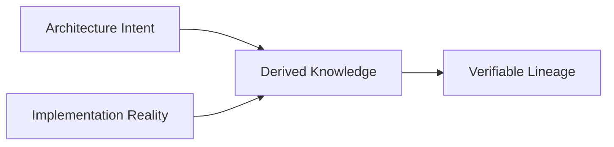
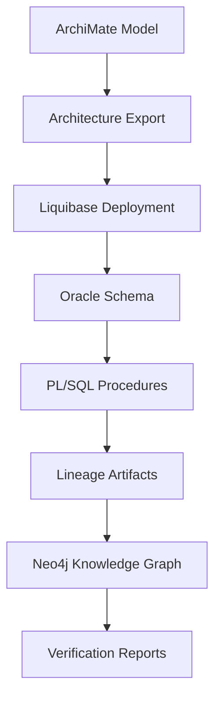
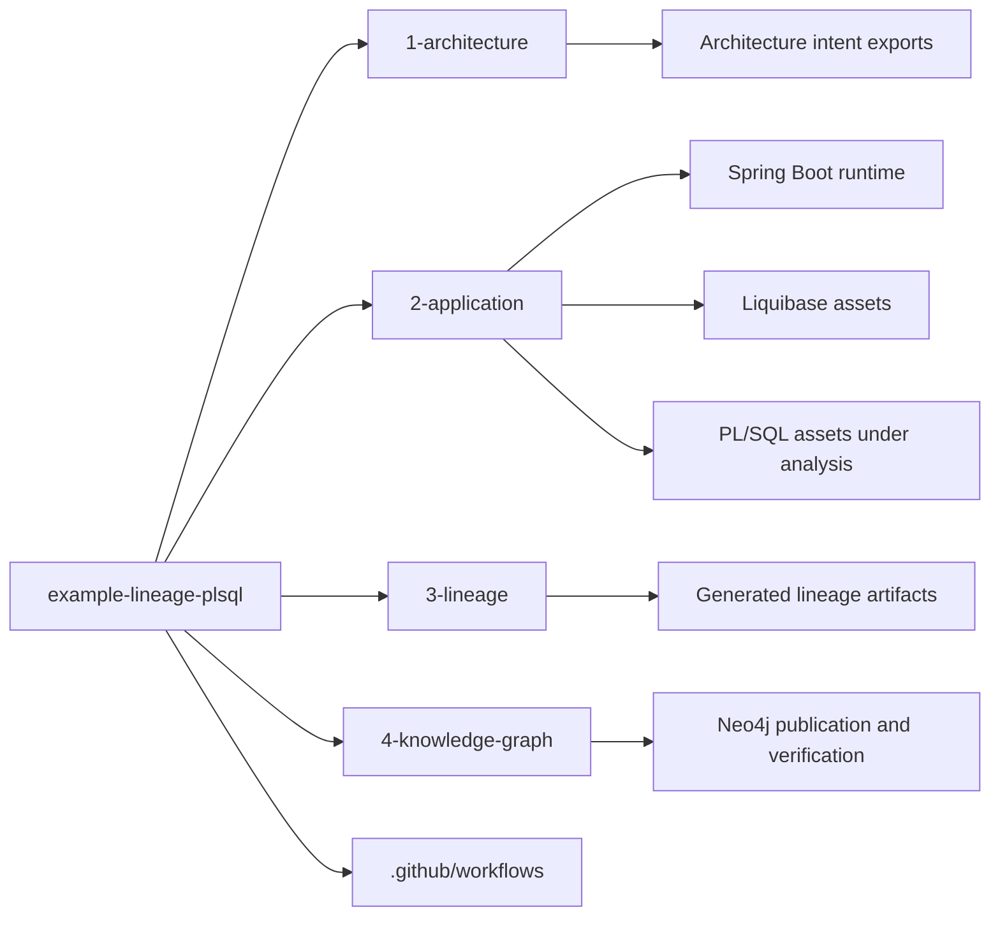
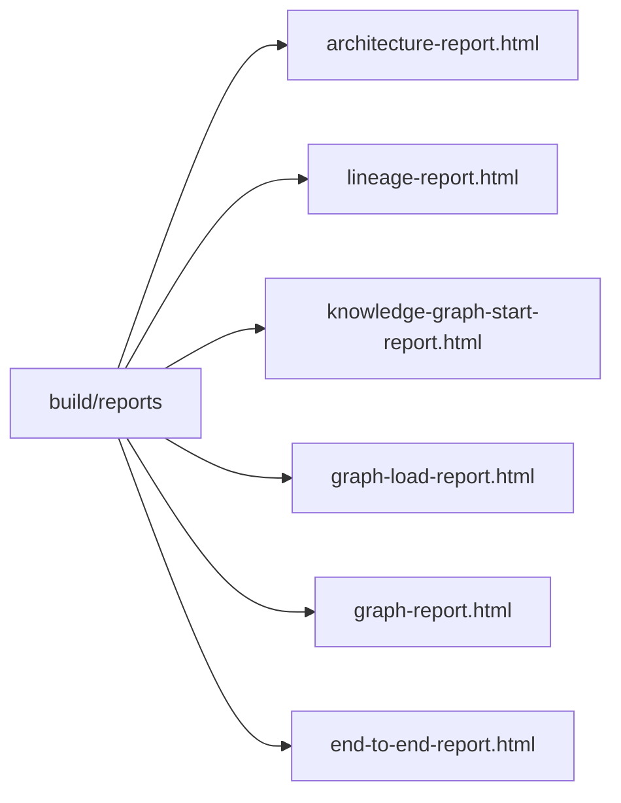
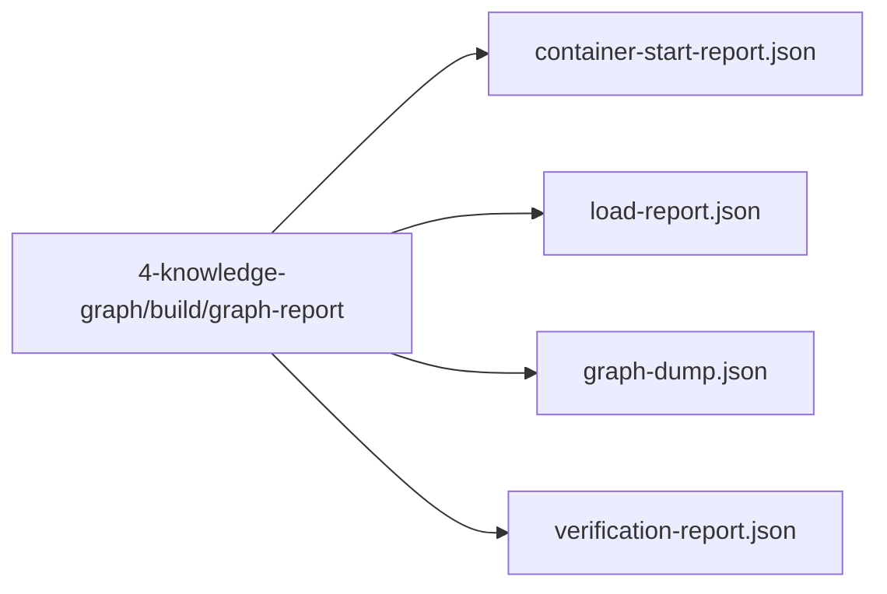
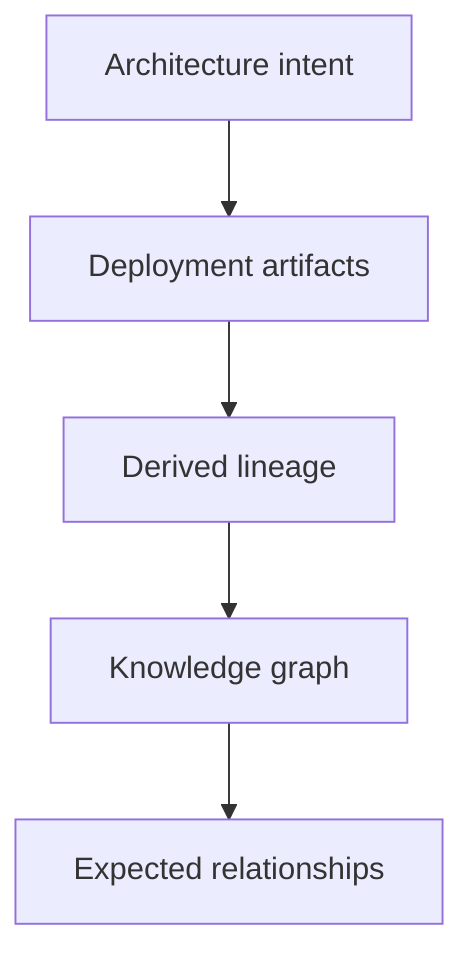

# example-lineage-plsql


[](https://github.com/jurgenei/example-lineage-plsql/actions/workflows/ci.yml)
[](https://github.com/jurgenei/example-lineage-plsql/actions/workflows/coverage.yml)
[](https://github.com/jurgenei/example-lineage-plsql/actions/workflows/codeql.yml)
[](https://github.com/jurgenei/example-lineage-plsql/actions/workflows/dependency-check.yml)
[](https://github.com/jurgenei/example-lineage-plsql/actions/workflows/spotbugs-security.yml)
[](https://github.com/jurgenei/example-lineage-plsql/security/dependabot)
[](https://codecov.io/gh/jurgenei/example-lineage-plsql)
[](LICENSE)
[](https://www.oracle.com/java/)
[](https://gradle.org/)

A runnable reference implementation demonstrating how lineage can be derived from implementation artifacts, verified through automated tests, and published as reusable lineage and graph-based knowledge.

The project provides an end-to-end example spanning:

- Architecture intent
- Oracle schema management with Liquibase
- PL/SQL transformations
- Lineage derivation
- Knowledge graph publication
- Automated verification
- End-to-end reporting

Rather than treating lineage as documentation, this repository treats lineage as a reproducible engineering artifact.

---

# Why This Repository Exists

Many lineage examples produce diagrams.

This repository demonstrates a complete and executable lineage lifecycle:



Every lineage assertion should:

- originate from evidence
- be reproducible
- be testable
- be traceable back to source artifacts

The repository is intended as:

- a learning resource
- a reference implementation
- a verification platform

---

# Relationship to the Jurgenei Initiative

This repository is the executable reference implementation.

Broader concepts such as:

- Near-Reality Lineage
- Continuous Architecture Reconciliation
- Extract → Derive → Resolve → Publish
- Canonical Enterprise Graphs
- Enterprise Knowledge Compilation

belong in the `jurgenei` repository.

This repository focuses on demonstrating those ideas through running software and verifiable results.

---

# What Gets Built



---

# Learning Paths

## Reader

Understand the concepts, architecture, reports and generated outputs.

## Practitioner

Run the complete lifecycle and inspect generated lineage.

## Contributor

Extend architecture, database, lineage or graph capabilities while maintaining verification.

---

# Progressive Learning Levels

## Level 0 – Environment

Build the platform and start required services.

## Level 1 – Architecture Intent

Export architecture models and establish intended relationships.

## Level 2 – Database Model

Deploy Liquibase definitions and create Oracle objects.

## Level 3 – Transformation Logic

Execute PL/SQL transformations.

## Level 4 – Lineage Derivation

Generate lineage from deployed artifacts.

## Level 5 – Knowledge Graph Publication

Load derived information into Neo4j.

## Level 6 – Verification

Validate expected relationships and lineage paths.

---

# Technology Stack

- Java 21
- Spring Boot 3.3
- Liquibase XML changelogs
- Oracle XE via Testcontainers
- Neo4j via Testcontainers
- Gradle

---

# Repository Structure



---

# Prerequisites

- Docker
- Java 21
- Archi Runtime (for architecture export)

---

# Quick Start

Run the complete end-to-end lifecycle:

```bash
./gradlew endToEndTest
```

Or execute stages individually:

```bash
./gradlew assembleArchitecture
./gradlew generateLineage
./gradlew startKnowledgeGraph
./gradlew loadKnowledgeGraph
./gradlew verifyKnowledgeGraph
./gradlew endToEndTest
```

Expected outcome:

```text
✓ Architecture exported
✓ Schema deployed
✓ Procedures created
✓ Lineage generated
✓ Graph loaded
✓ Verification completed
```

---

# Verification Strategy

Lineage is treated as an engineering discipline.

Verification is performed through:

- Structure bootstrap tests
- Cross-module contract tests
- End-to-end graph verification tests
- Oracle integration tests

Build success demonstrates that derived outputs satisfy expected relationships.

---

# TDD Growth Progression

- GrowthStructureBootstrapTest
- GrowthCrossModuleContractTest
- GrowthEndToEndGraphVerificationContractTest
- LineageLoaderIntegrationTest

The project grows incrementally from structure validation toward full end-to-end lineage verification.

---

# Generated Reports

## Root Reports



## Knowledge Graph Reports



---

# CI/CD

The CI pipeline validates four gated stages:

- structure-and-contract-tests
- lineage-tests
- graph-tests
- e2e-tests

Coverage is generated through JaCoCo and published via Codecov.

---

# Local Development

Run staged growth tests:

```bash
./gradlew :application:test --tests name.jurgenei.example.lineage.GrowthStructureBootstrapTest
./gradlew :application:test --tests name.jurgenei.example.lineage.GrowthCrossModuleContractTest
./gradlew :application:test --tests name.jurgenei.example.lineage.GrowthEndToEndGraphVerificationContractTest
```

Run Oracle integration tests:

```bash
./gradlew :application:test --tests name.jurgenei.example.lineage.LineageLoaderIntegrationTest
```

Run graph verification:

```bash
./gradlew verifyKnowledgeGraph endToEndTest
```

---

# Design Principles

- Derive rather than manually maintain metadata.
- Keep lineage reproducible.
- Prefer evidence over documentation.
- Keep module contracts explicit.
- Verify graph structures deterministically.
- Treat architecture and lineage as continuously verifiable artifacts.

---

# Success Criteria

A successful build should prove that:



remain consistent and verifiable.

The goal is not merely to generate lineage.

The goal is to generate lineage that can be trusted.
